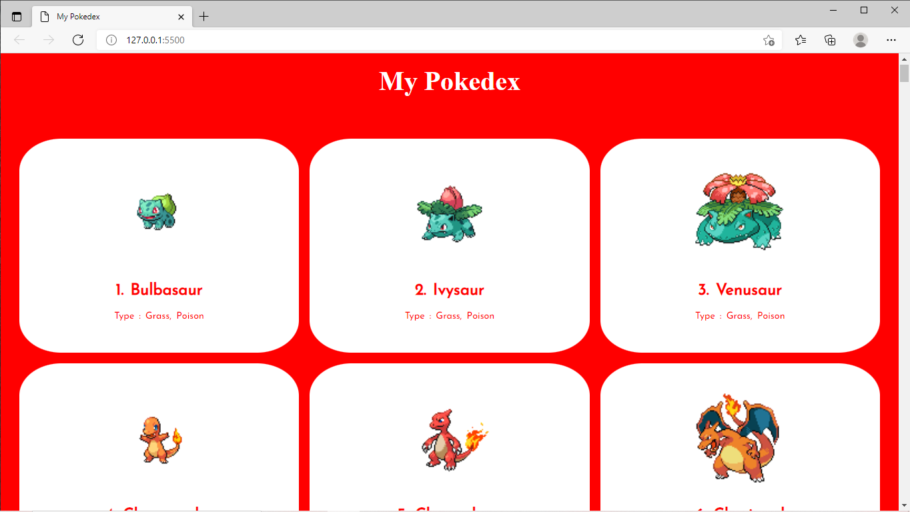
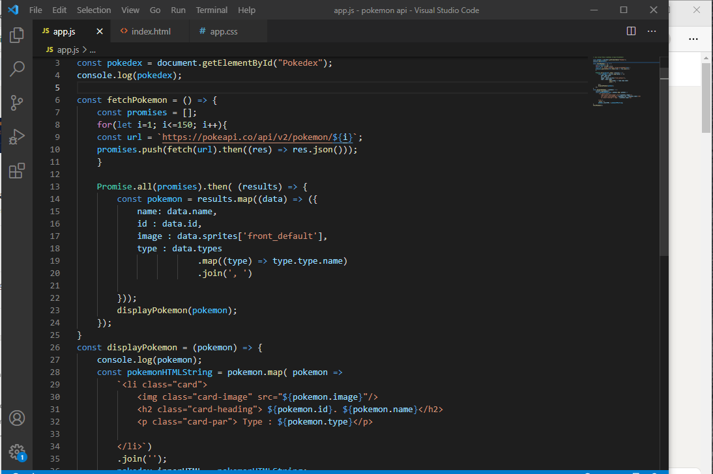

# My-pokedex
It's my first api project using javascript and little bit of HTML and CSS

### The Pokemon api help us to get data various pokemon exist in Pokemon world

[Pokemon APi](https://pokeapi.co/api/v2/pokemon/) Using this api I have crapped the name of the pokemon and type of pokemon 

